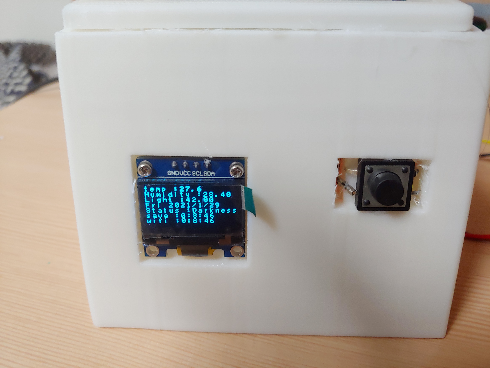

# Arduino_Table_Clock
아두이노 스마트 탁상시계 프로젝트 / Arduino Smart Desk Clock Project

** 강원FABLAB (한림대학교 산업협력단) Fab Lab Gangwon Making project - 디지털 장비를 활용한 메이킹 프로젝트

자취방 아이템 스마트 탁상시계  (1월 18일 ~ 1월 29일) 2주
------------------------------

**작동 영상**



**작동 설명** 

자취방 혹은 기숙사에서 온도와 습도 그리고 조도 데이터를 눈으로 직접 확인하기 어렵다.

이 프로젝트는 거주공간에서 시계역활을 해주는 동시에 자취방 **온도, 습도, 조도** 데이터를 25초 간격으로 

**SD카드에 저장**하고 **API 서버**에 데이터를 보낸다.

이러한 데이터를 꾸준히 쌓아서 파이썬을 통해 **시각화를 거치면 거주 공간의 문제점을 파악할 수 있다.**

데이터는 SD카드와 인터넷 서버를 통해 이중으로 저장하는 만큼 어느 상황에서도 작동을 보장한다.

**기본 모드**

**기본 모드** 에서는 실시간으로 시간을 확인 할 수 있다.

별다른 조작이 없다면 기본 모드를 유지한다.

**상세 모드**

상세 모드는 전면의 버튼을 클릭했을 때 4초간 보여준다.

상세 모드에서 보여줄 수 있는 정보은 하단의 내용과 같다.

\- temp : 현재 온도

\- Humidity : 현재 습도

\- 날짜

\- 현재 상태(빛) 5단계

 Very Bright – 매우 밝음

 Bright – 밝음

 Slight darkness – 약간 어두움

 Darkness – 어두움

 Very dark – 매우 어두움

\- save : 마지막 sd 저장 시간

\- wifi : 마지막 와이파이 저장 시간

**[2021-01-29일~ 2021년 02월 03일 데이터 그래프 (온도 temp / 습도 humi)]**

실제로 저장받은 5일 동안의 데이터를 시각화를 시키면 알 수 있듯이.

습도와 온도는 상관 관계가 있다.

이는 생활 패턴과 관련이 있는데 화장실을 이용하고 문을 열어두면 굉장히 많은 습도가 방을 채운다.

또 동시에 온도가 높아지는 것을 확인할 수 있다.

창문을 열면은 추운 바람이 들어오면서 온도와 습도는 극격하게 내려가는 것을 확인할 수 있다.

습도는 20~35 사이로 적절한 습도를 유지하고 있음을 보여준다.(습도는 20 이하로 내려가지 않는 것이 좋다.)

**평균 온도**는 **27.5도**이고

**평균 습도**는 **27%** 이다.

데이터는 꾸준히 온라인과 SD카드에 저장되고 있다.

[thingspeak 온라인 데이터](https://thingspeak.com/channels/1291441)

[SD카드 데이터]

마지막으로 프로젝트 후반에 추가된 조도 데이터는 사용자의 잠자는 시간과 패턴 등을 분석하기 좋다.

조도 데이터는 0(불빛 없음) ~ 1000 이상으로 데이터 편차가 크므로 log를 취해서 편차를 줄이면 조금더 유의미한 데이터를 얻을 수 있다.

- **내부 부품**

1. 아두이노 NANO 33 IOT
2. RTC DS3231 모듈
3. 0.96인치 128x64 OLED LCD 모듈
4. SD 카드 리더기 모듈
5. TEMT6000 조도 센서 모듈
6. [YwRobot] AM2302 (DHT22) 고정밀 온습도 센서 모듈

- 참고 사이트
  아두이노 Nano 33 IOT  
  https://fishpoint.tistory.com/5251
  RTC 모듈
  https://deneb21.tistory.com/327
  0.96인치 128x64 OLED LCD 모듈
  https://orasman.tistory.com/297

